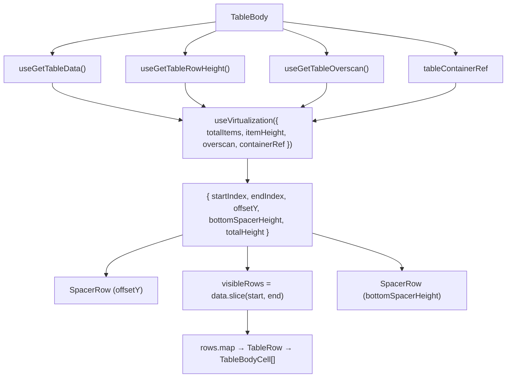

# TableBody Architecture

Virtualized `<tbody>` that renders only the visible row window using
`useVirtualization`. Each row maps effective columns to `TableBodyCell` instances.

## File Structure

```
TableBody/
├── TableBody.component.tsx   → <tbody> with virtualization + row mapping
├── TableBody.types.ts        → TableBodyProps (tableContainerRef)
├── TableBody.stylex.ts       → Body height for scroll area
├── index.ts                  → Barrel export
│
└── utils/
    └── generatePlaceholderData.util.ts → Creates skeleton row objects
```

## Context Dependencies

| Selector                 | Purpose                         |
| ------------------------ | ------------------------------- |
| `useGetEffectiveColumns` | Ordered/filtered column list    |
| `useGetColumnPinning`    | Pinning state for offset calc   |
| `useGetColumnSizing`     | Column widths for offset calc   |
| `useGetTableRowHeight`   | Row height for virtualization   |
| `useGetTableOverscan`    | Extra rows above/below viewport |
| `useGetTableData`        | Full data array                 |

## Virtualization Flow



## Cell Rendering

For each visible row, every effective column produces a `TableBodyCell`:

- **Custom render**: If `column.render` is defined, call it with row data
- **Default render**: Pass `value`, `dataType`, `format`, `label` to auto-format

Each cell receives computed `pinInfo` from `getPinnedColumnOffsets()`.
