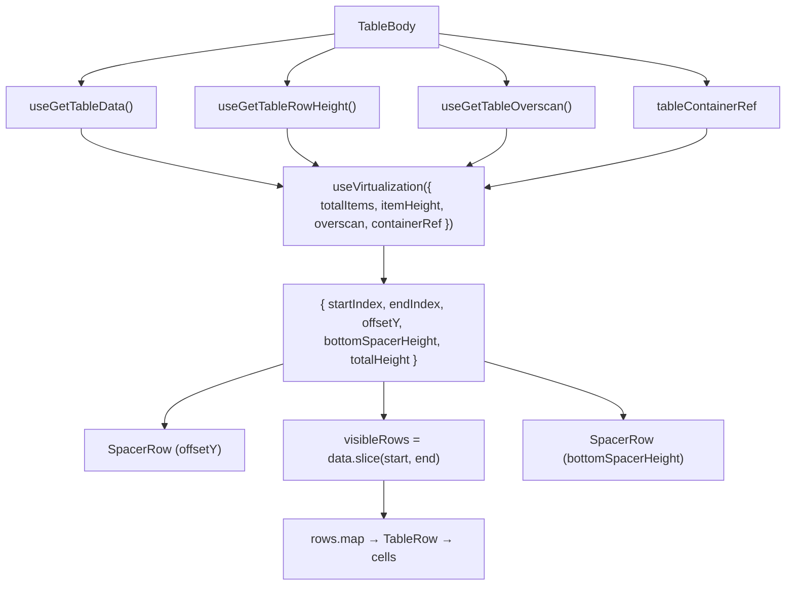
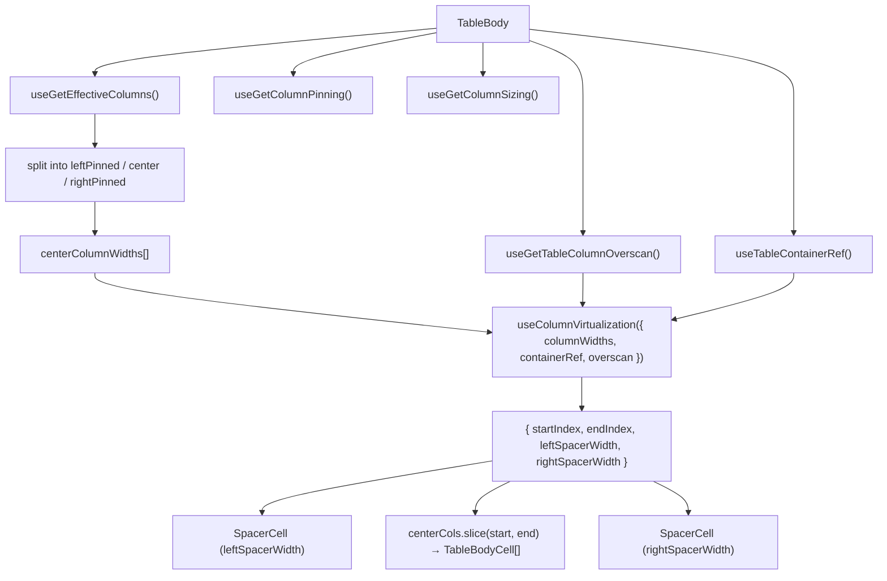

# TableBody Architecture

Virtualised `<tbody>` that renders only the visible row **and** column
windows using `useVirtualization` (rows) and `useColumnVirtualization`
(columns). Each visible row maps the visible centre columns plus all pinned
columns to `TableBodyCell` instances.

## File Structure

```
TableBody/
├── TableBody.component.tsx   → <tbody> with row + column virtualisation
├── TableBody.test.tsx        → Unit tests for virtualisation window and custom cell rendering
├── TableBody.types.ts        → TableBodyProps (tableContainerRef)
├── TableBody.stylex.ts       → Body height for scroll area
├── index.ts                  → Barrel export
│
└── utils/
    └── generatePlaceholderData.util.ts → Creates skeleton row objects
```

## Context Dependencies

| Selector                    | Purpose                              |
| --------------------------- | ------------------------------------ |
| `useGetEffectiveColumns`    | Ordered/filtered column list         |
| `useGetColumnPinning`       | Pinning state for offset calc        |
| `useGetColumnSizing`        | Column widths for offset calc        |
| `useGetTableRowHeight`      | Row height for row virtualisation    |
| `useGetTableOverscan`       | Extra rows above/below viewport      |
| `useGetTableColumnOverscan` | Extra columns left/right of viewport |
| `useGetTableData`           | Full data array                      |
| `useTableContainerRef`      | Shared scroll container ref          |

## Row Virtualisation Flow



## Column Virtualisation Flow



## Per-Row Cell Order

```
[leftPinnedCells] | [SpacerCell left?] | [visibleCenterCells] | [SpacerCell right?] | [rightPinnedCells]
```

## Cell Rendering

For each visible row, every rendered column produces a `TableBodyCell`:

- **Custom render**: If `column.render` is defined, call it with row data
- **Default render**: Pass `value`, `dataType`, `format`, `label` to auto-format

Each cell receives computed `pinInfo` from `getPinnedColumnOffsets()`.
