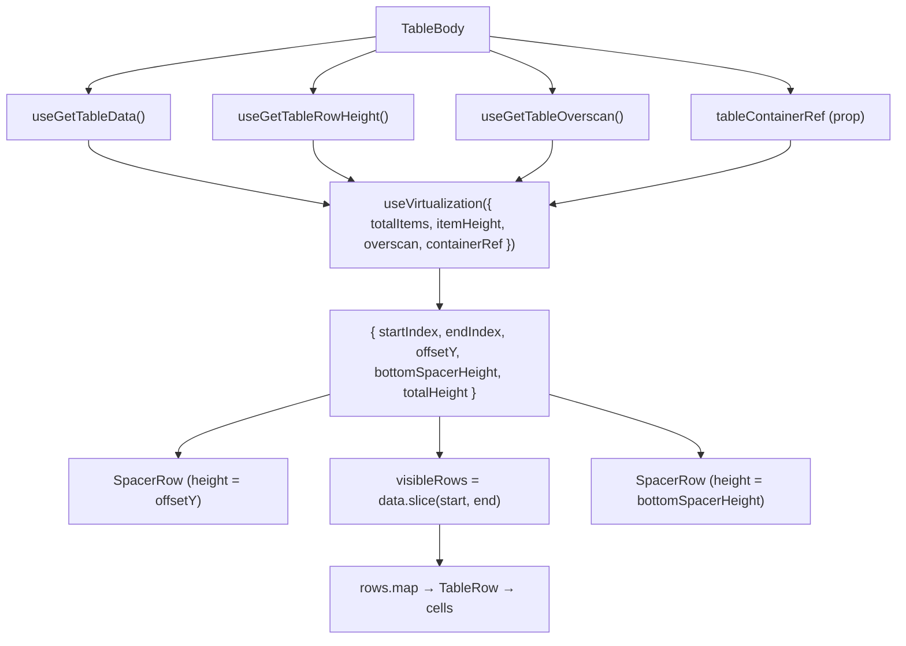
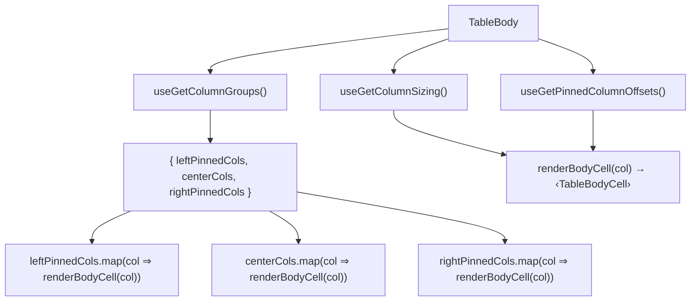

# TableBody Architecture

Virtualised `<tbody>` that renders only the visible row window using
`useVirtualization`. The body uses **SpacerRow** components above and below
the visible rows to maintain correct scroll height in normal document flow.
Column groups and pinned offsets are read from the columns store as
pre-computed derived state. Each visible row maps all column groups
(left-pinned, center, right-pinned) to `TableBodyCell` instances.

## Design Decision — SpacerRow vs Absolute Positioning

An earlier implementation used `position: absolute` + `transform: translateY()`
per row in a grid-layout `<tbody>`. This caused **visible black gaps during
fast scrolling** because row position updates lagged behind scroll events.

The current SpacerRow approach places rows in normal document flow with
invisible spacer `<tr>` elements above (for `offsetY`) and below (for
`bottomSpacerHeight`). The browser layout engine keeps content contiguous,
eliminating visual gaps regardless of scroll speed.

## File Structure

```
TableBody/
├── TableBody.component.tsx   → <tbody> with SpacerRow-based row virtualisation
├── TableBody.test.tsx        → Unit tests for virtualisation window, cell rendering, spacers
├── TableBody.types.ts        → TableBodyProps (tableContainerRef)
├── TableBody.stylex.ts       → Placeholder (no active styles; spacers handle positioning)
├── index.ts                  → Barrel export
│
└── utils/
  ├── ARCHITECTURE.md                 → TableBody utility architecture
  ├── buildTableBodyCellDescriptor.util.ts → Derives pure cell descriptor data
  ├── createRenderTableBodyCell.util.ts    → Creates stable cell renderer bound to sizing/offsets
  ├── generatePlaceholderData.util.ts → Creates skeleton row objects
  ├── getTotalVisibleColumnCount.util.ts → Computes spacer-row colSpan
  ├── renderTableBodyColumnGroup.util.ts → Maps a column group to rendered cells
  └── index.ts                        → Utility barrel exports
```

## Context Dependencies

| Selector                    | Purpose                                        |
| --------------------------- | ---------------------------------------------- |
| `useGetColumnGroups`        | Pre-split column groups (left, center, right)  |
| `useGetColumnSizing`        | Column widths for cell rendering               |
| `useGetPinnedColumnOffsets` | Pre-computed sticky offsets for pinned columns |
| `useGetTableRowHeight`      | Row height for row virtualisation              |
| `useGetTableOverscan`       | Extra rows above/below viewport                |
| `useGetTableData`           | Full data array                                |
| `useGetTableIsLoading`      | Initial loading state                          |
| `useGetTableIsLoadingMore`  | Pagination loading state                       |

## Row Virtualisation Flow



## Render Structure

```
<tbody>
  ├── SpacerRow (offsetY > 0)          ← top padding
  ├── TableRow[startIndex]             ← normal document flow
  ├── TableRow[startIndex + 1]
  ├── ...
  ├── TableRow[endIndex - 1]
  └── SpacerRow (bottomSpacerHeight > 0) ← bottom padding
</tbody>
```

## Column Rendering Flow



Column groups and pinned offsets are derived state stored in `columnsStore`.
They are recomputed by store actions whenever `effectiveColumns`,
`columnPinning`, or `columnSizing` change, so the component reads them
directly without any per-render calculation.

## Per-Row Cell Order

```
[leftPinnedCells] | [centerCells] | [rightPinnedCells]
```

## Cell Rendering

The body renders cells using the same declarative `.map()` → JSX pattern
as the header. A `renderBodyCell` helper per row returns `<TableBodyCell>`
directly:

- **Custom render**: If `column.render` is defined, passes children to `<TableBodyCell>`
- **Default render**: Passes `value`, `dataType`, `format`, `label` as props
- Each cell receives `pinInfo` from the store's `pinnedColumnOffsets` slice
- Width is resolved from `columnSizing[col.key]` or `col.minWidth`
- **SpacerRow** `colSpan` = `leftPinnedCols.length + centerCols.length + rightPinnedCols.length`
