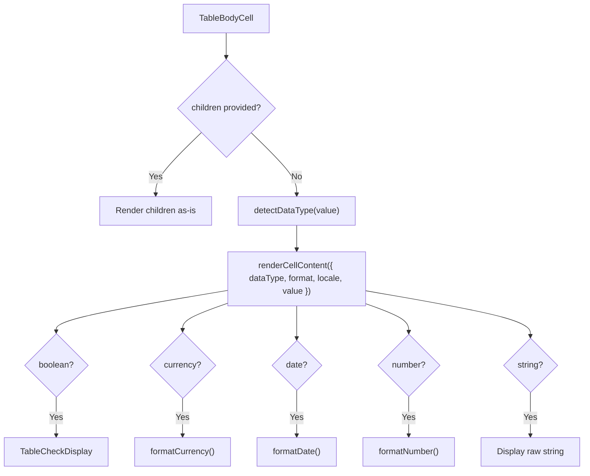

# TableBodyCell Architecture

Data cell that auto-detects the data type and renders formatted content
with support for pinning, loading overlays, and custom render functions.

## File Structure

```
TableBodyCell/
├── TableBodyCell.component.tsx   → <td> with auto-format + pinning + shimmer
├── TableBodyCell.types.ts        → TableBodyCellProps (value, pinInfo, format, ...)
├── TableBodyCell.stylex.ts       → Alignment, pinning offsets, shimmer overlay
├── index.ts                      → Barrel export
│
└── utils/
    ├── detectDataType.util.ts     → Infer type from value (boolean/number/currency/date/string)
    ├── renderCellContent.util.tsx  → Format + render based on data type
    └── index.ts
```

## Props

| Prop       | Type                   | Description                               |
| ---------- | ---------------------- | ----------------------------------------- |
| `value`    | `unknown`              | Cell data value                           |
| `dataType` | `TableColumnDataType?` | Override auto-detected type               |
| `format`   | `TableColumnFormat?`   | Formatting options (currency/date/number) |
| `label`    | `string?`              | Column label for accessibility            |
| `pinInfo`  | `PinnedColumnInfo?`    | Pin side, offset, shadow flags            |
| `minWidth` | `number?`              | Minimum cell width                        |
| `width`    | `number \| string?`    | Current cell width                        |
| `children` | `ReactNode?`           | Custom content (overrides default)        |
| `locale`   | `string?`              | Locale for formatting                     |

## Rendering Pipeline



## Auto-Detection Rules (`detectDataType`)

| Value Pattern        | Detected Type |
| -------------------- | ------------- |
| `typeof boolean`     | `boolean`     |
| `typeof number`      | `number`      |
| Starts with `$€£¥₹`  | `currency`    |
| Matches `YYYY-MM-DD` | `date`        |
| Everything else      | `string`      |

## Alignment

- **Right-aligned**: number, currency
- **Centered**: boolean, date
- **Left-aligned** (default): string, custom content

## Loading State

Shimmer overlay when `useGetTableIsLoading()` or `useGetTableIsLoadingMore()` is true.
