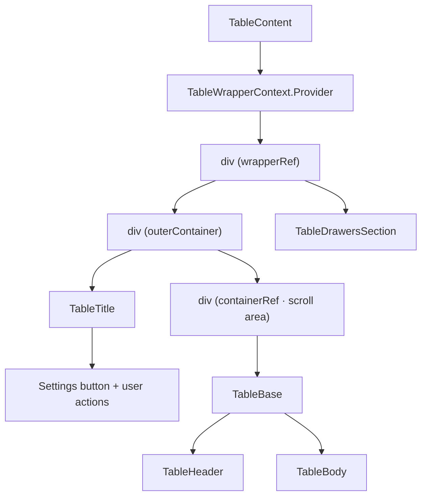
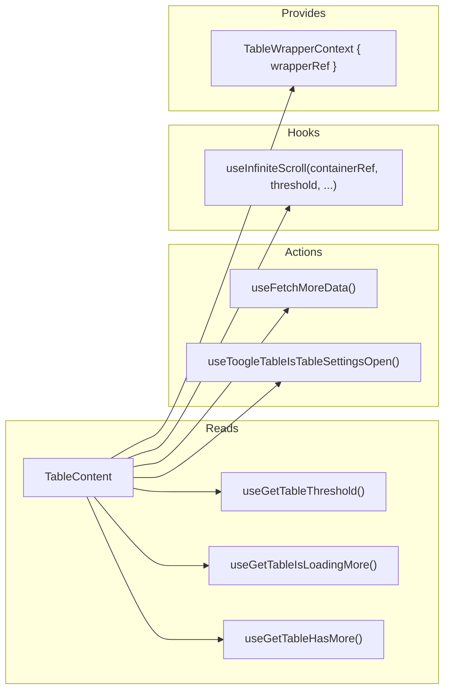

# TableContent Architecture

Main layout component that assembles the table UI: title bar, scrollable
table container with header/body, infinite scroll, and settings drawers.
Also provides the `TableWrapperContext` with a ref to the wrapper element.

## File Structure

```
TableContent/
├── TableContent.component.tsx   → Layout: Title + scroll container + drawers
├── TableContent.types.ts        → TableContentProps (picks from TableProps)
├── TableContent.stylex.ts       → Wrapper, outer container, scroll container
└── index.ts                     → Barrel export
```

## Render Structure



## Context & Hooks



## Refs

| Ref            | Element        | Purpose                                    |
| -------------- | -------------- | ------------------------------------------ |
| `containerRef` | Scroll `<div>` | Infinite scroll detection + virtualization |
| `wrapperRef`   | Outer `<div>`  | Provided via `TableWrapperContext`         |

## Infinite Scroll

The `useInfiniteScroll` hook monitors `containerRef` scroll position.
When the user scrolls within `threshold` pixels of the bottom and
`hasMore` is true, it calls `fetchMoreData()` which appends the next
page to `dataStore`.
