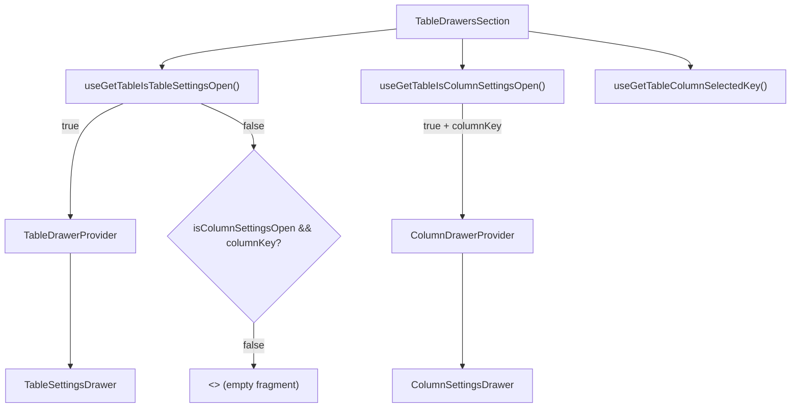

# TableDrawersSection Architecture

Conditional renderer for table-level and column-level settings drawers.
Reads meta state to decide which drawer to show, and wraps each in its
own context provider.

## File Structure

```
TableDrawersSection/
├── TableDrawersSection.component.tsx   → Conditional drawer rendering
└── index.ts                            → Barrel export
```

## Render Logic



## Context Providers

Each drawer gets its own provider so the drawer-local store is only
created when the drawer is open:

- **TableDrawerProvider** → wraps `TableSettingsDrawer`
- **ColumnDrawerProvider** → wraps `ColumnSettingsDrawer` with `columnKey`
