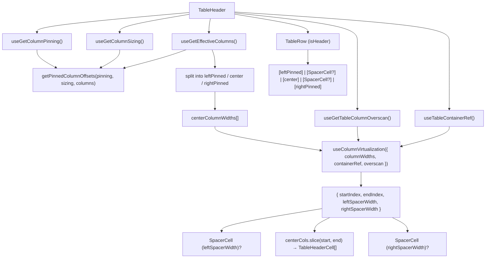

# TableHeader Architecture

Renders `<thead>` with a single header row. Maps effective columns to
`TableHeaderCell` instances with computed pinned offsets. Applies column
virtualisation so only the visible center columns are rendered, with
`SpacerCell` spacers for hidden columns.

## File Structure

```
TableHeader/
├── TableHeader.component.tsx   → <thead> → TableRow → TableHeaderCell[] (column-virtualised)
├── TableHeader.types.ts        → TableHeaderProps extends <thead>
├── TableHeader.stylex.ts       → Sticky header positioning
└── index.ts                    → Barrel export
```

## Context Dependencies

| Selector                    | Purpose                              |
| --------------------------- | ------------------------------------ |
| `useGetEffectiveColumns`    | Ordered/filtered column list         |
| `useGetColumnPinning`       | Pinning state for offset calc        |
| `useGetColumnSizing`        | Column widths for offset calc        |
| `useGetTableColumnOverscan` | Extra columns left/right of viewport |
| `useTableContainerRef`      | Shared scroll container ref          |

## Render Flow



Each `TableHeaderCell` receives `columnKey`, `hasSettings`, and `pinInfo`.
