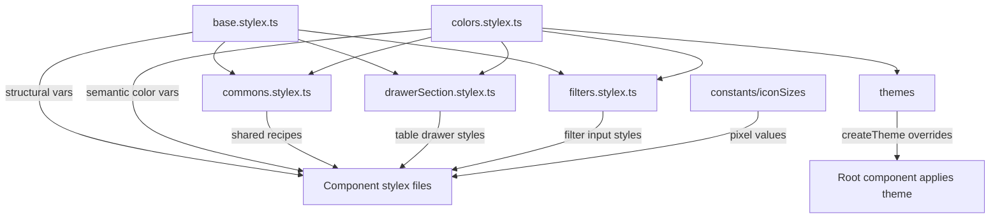
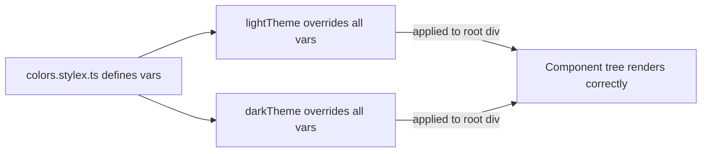
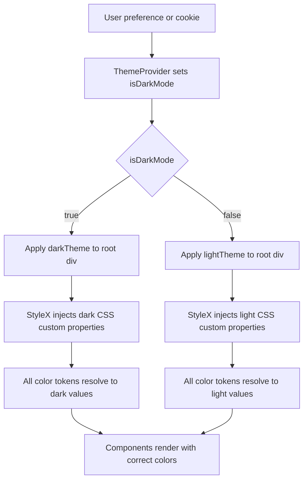

# Design System Architecture

## Overview

The design system is a three-layer StyleX-based styling foundation that provides **tokens**, **themes**, and **JS constants** to all components in the application.

It does not contain any React components or UI logic — it is purely a styling contract. Components consume it by importing from subdirectory paths directly (no root barrel file exists).

---

## Directory Structure

```
src/design-system/
├── constants/
│   ├── iconSizes.constants.ts   # Named pixel values for icon sizes (XXS–LG)
│   └── index.ts                 # Barrel for constants
├── themes/
│   ├── dark.stylex.ts           # Dark theme overrides (createTheme)
│   └── light.stylex.ts          # Light theme overrides (createTheme)
└── tokens/
    ├── base.stylex.ts           # Structural tokens: spacing, typography, radius, shadow, z-index, timing
    ├── colors.stylex.ts         # Semantic color tokens: theme-variable CSS custom properties
    ├── commons.stylex.ts        # Reusable style recipes: interactive elements, ripple, variants, skeleton
    ├── drawerSection.stylex.ts  # Shared layout styles for Table Settings Drawer sections
    └── filters.stylex.ts        # Shared input styles for filter components
```

---

## Token Layers



---

## Layer Reference

### `tokens/base.stylex.ts` — Structural Tokens

Static design values defined with `stylex.defineVars`. These never change between themes.

| Export         | Contents                                                        |
| -------------- | --------------------------------------------------------------- |
| `spacing`      | `xxs` 4px → `xxxl` 64px (8-step scale)                          |
| `typography`   | Font family, size scale (`xs`–`3xl`), weights, line heights     |
| `borderRadius` | `none`, `sm` 4px, `md` 8px, `lg` 12px, `xl` 16px, `full` 9999px |
| `shadows`      | `none`, `sm`, `md`, `lg`, `xl` — static rgba shadows            |
| `zIndex`       | `base` 0 → `tooltip` 1500 (5-step layering scale)               |
| `transitions`  | `fast` 150ms, `normal` 200ms, `slow` 300ms, `slower` 500ms      |
| `easing`       | `easeIn`, `easeOut`, `easeInOut`, `linear`                      |
| `tooltip`      | Arrow size, arrow offset, slide distance                        |

---

### `tokens/colors.stylex.ts` — Semantic Color Tokens

Defines CSS custom property placeholders with `stylex.defineVars`. Values are CSS variable references (`var(--brand-primary)`, etc.) — the actual colors are injected by the active theme.

Color categories:

| Category                | Tokens                                                                                          |
| ----------------------- | ----------------------------------------------------------------------------------------------- |
| **Brand**               | `brandPrimary`, `brandSecondary` + `Hover`, `Active`, `Background`, `CardText`, `Text` variants |
| **Semantic**            | `success`, `error`, `warning`, `info` + `Background`, `CardText`, `Hover`, `Text` variants      |
| **Neutral backgrounds** | `backgroundPrimary`, `backgroundSecondary`, `backgroundTertiary`                                |
| **Surfaces**            | `surfacePrimary`, `surfaceSecondary`, `surfaceElevated`, `surfaceStripe`                        |
| **Borders**             | `borderPrimary`, `borderSecondary`, `borderFocus`                                               |
| **Text**                | `textPrimary`, `textSecondary`, `textTertiary`, `textInverse`                                   |
| **Interactive**         | `hover`, `active`, `overlay`, `shadowHover`                                                     |
| **Disabled**            | `disabled`, `disabledText`                                                                      |

---

### `tokens/commons.stylex.ts` — Shared Style Recipes

Reusable `stylex.create` rule sets shared across interactive components (Button, NavLink, Toolbar items). Depends on `base.stylex.ts` and `colors.stylex.ts`.

| Export                          | Purpose                                                                                   |
| ------------------------------- | ----------------------------------------------------------------------------------------- |
| `baseInteractiveStyles.element` | Base flex container for buttons/links: appearance, focus ring, transitions, cursor        |
| `baseInteractiveStyles.label`   | Truncatable text label, hides at container widths below 60px                              |
| `baseInteractiveStyles.icon`    | Fixed 20×20 flex icon container                                                           |
| `rippleBase.ripple`             | Radial ripple expansion animation on `:active`                                            |
| `widthVariants`                 | `auto` / `full` width                                                                     |
| `colorVariants`                 | `primary`, `secondary`, `ghost`, `outline`, `error`, `danger-ghost`, `success`, `warning` |
| `sizeVariants`                  | `embedded`, `mini`, `sm`, `md`, `lg` (height + padding + font-size per size)              |
| `orientationVariants`           | `horizontal` (center-justified) / `vertical` (start-justified) for nav rendering          |
| `skelleton`                     | `loadingOverlay` and `placeholderBar` with shimmer keyframe animation                     |

---

### `tokens/drawerSection.stylex.ts` — Table Drawer Shared Styles

Domain-scoped styles extracted from Table Settings Drawer sections to avoid repetition. Used by `SortingSection`, `AddFilterSection`, `ColumnOrderSection`, `ActiveFiltersList`, `GeneralSettingsSection`, and related components.

| Export                              | Key Rules                                                     |
| ----------------------------------- | ------------------------------------------------------------- |
| `drawerSectionStyles.container`     | `flex-direction: column`, `gap: md`                           |
| `drawerSectionStyles.containerFull` | Same + `height: 100%`                                         |
| `drawerSectionStyles.sectionMain`   | Fills height, pushes footer to bottom                         |
| `drawerSectionStyles.header`        | Secondary text, small bold, bottom margin                     |
| `drawerSectionStyles.headerRow`     | Flex row, `height: 28px`, space-between                       |
| `drawerSectionStyles.headerTitle`   | Like `header` but without bottom margin (used in `headerRow`) |
| `drawerSectionStyles.headerToolbar` | Flex row for mini action buttons in `headerRow`               |
| `drawerSectionStyles.subsection`    | `flex-direction: column`, `gap: sm`                           |
| `drawerSectionStyles.list`          | Vertical list, `gap: sm`                                      |
| `drawerSectionStyles.itemRow`       | Horizontal row, `gap: sm`, vertically centered                |

---

### `tokens/filters.stylex.ts` — Filter Input Shared Styles

Domain-scoped styles for filter input components in the Table. Provides consistent input heights, borders, and focus rings.

| Export                          | Key rules                                                   |
| ------------------------------- | ----------------------------------------------------------- |
| `filterBaseStyles.container`    | `flex-direction: column`, `gap: sm`                         |
| `filterBaseStyles.input`        | Full-width, `height: 2.25rem`, border with focus transition |
| `filterBaseStyles.inputWrapper` | `position: relative`, clipped height                        |
| `filterBaseStyles.inputGroup`   | Horizontal input + addon row                                |
| `filterBaseStyles.select`       | Styled native `<select>` with focus ring                    |
| `filterBaseStyles.separator`    | Secondary text for "between" operators                      |

---

### `themes/` — Theme Overrides

Two theme files, each calling `stylex.createTheme(colors, { ... })` to supply OKLCH color values for every token in `colors.stylex.ts`.



The themes share the same base anchors for semantic colors (`success`, `error`, `warning`, `info`) but invert neutral scales:

- **Light**: dark text on light surfaces (`textPrimary` ≈ `oklch(25%...)`)
- **Dark**: light text on dark surfaces (`textPrimary` ≈ `oklch(92%...)`)

Interactive state layers (`hover`, `active`) are also inverted — light uses dark-on-light overlays; dark uses light-on-dark overlays.

Both themes use **OKLCH** with relative color math (`oklch(from brandPrimary l-0.05 c+0.01 h)`) for computed hover/active states, ensuring perceptually uniform color relationships.

---

### `constants/` — JS Constants

Named pixel values for icon sizes consumed wherever the `size` prop on Icon components is set.

| Constant        | Value | Typical usage                         |
| --------------- | ----- | ------------------------------------- |
| `ICON_SIZE_XXS` | 10px  | —                                     |
| `ICON_SIZE_XS`  | 12px  | Tag close icon                        |
| `ICON_SIZE_SM`  | 14px  | Header sort indicators, header menu   |
| `ICON_SIZE_MD`  | 16px  | Drawer/toolbar buttons, list icons    |
| `ICON_SIZE_LG`  | 20px  | Side-panel titles, toolbar navigation |

---

## Theme Application Flow



`Root.component.tsx` applies the active theme as a StyleX prop on the top-level `<div>`:

```tsx
<div {...stylex.props(styles.base, isDarkMode ? darkTheme : lightTheme)}>
```

Components never reference a theme directly — they consume `colors.*` tokens, which resolve automatically via CSS custom properties.

---

## Import Patterns

There is no root `index.ts` barrel for `design-system`. All imports use direct subdirectory paths:

```ts
// Structural tokens
import {
  spacing,
  typography,
  borderRadius,
} from '@/design-system/tokens/base.stylex';

// Color tokens
import { colors } from '@/design-system/tokens/colors.stylex';

// Shared recipes
import {
  baseInteractiveStyles,
  colorVariants,
  sizeVariants,
} from '@/design-system/tokens/commons.stylex';

// Domain styles
import { drawerSectionStyles } from '@/design-system/tokens/drawerSection.stylex';
import { filterBaseStyles } from '@/design-system/tokens/filters.stylex';

// Theme objects (Root only)
import { lightTheme } from '@/design-system/themes/light.stylex';
import { darkTheme } from '@/design-system/themes/dark.stylex';

// Icon size constants
import { ICON_SIZE_MD } from '@/design-system/constants';
```

---

## Design Tradeoffs

| Decision                                            | Consequence                                                                                                                                                             |
| --------------------------------------------------- | ----------------------------------------------------------------------------------------------------------------------------------------------------------------------- |
| **OKLCH color space**                               | Perceptually uniform shifts; `oklch(from x l±n ...)` makes hover/active states predictable regardless of hue. Not supported in very old browsers.                       |
| **CSS custom property bridging**                    | `defineVars` emits CSS vars; `createTheme` overrides them. Components reference the var names, not raw values — themes swap with a single class on the root.            |
| **No root barrel**                                  | Consumers must know which subpath to import from. Prevents accidental coupling to all token files, but requires longer import paths.                                    |
| **`commons.stylex.ts` for shared recipes**          | Centralises button/link visual logic; reduces per-component duplication. Assumes all interactive elements share the same base shape — outliers need local overrides.    |
| **Domain token files (`drawerSection`, `filters`)** | Extracts repeated layout patterns into a shared location. Creates a light coupling from the token layer to specific domain concerns, which is a layering tradeoff.      |
| **Static shadows in `base`**                        | Shadow scale uses static `rgba` rather than theme variables — they do not invert between light and dark. `shadowHover` in `colors` is the exception and is theme-aware. |
