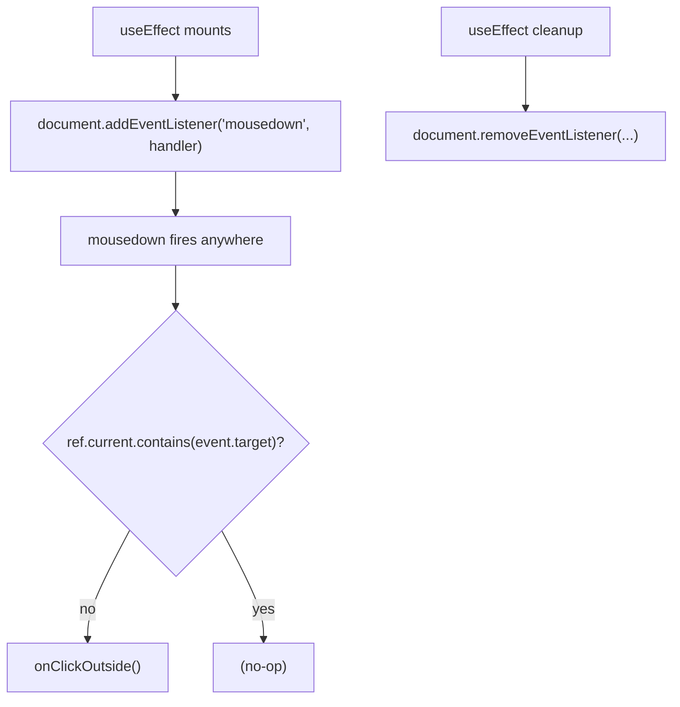
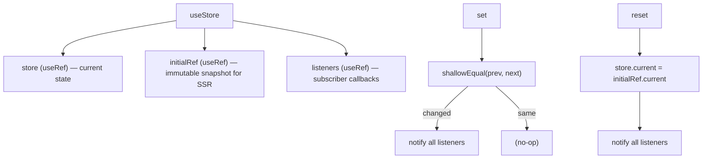
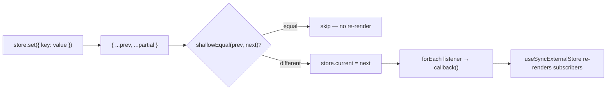
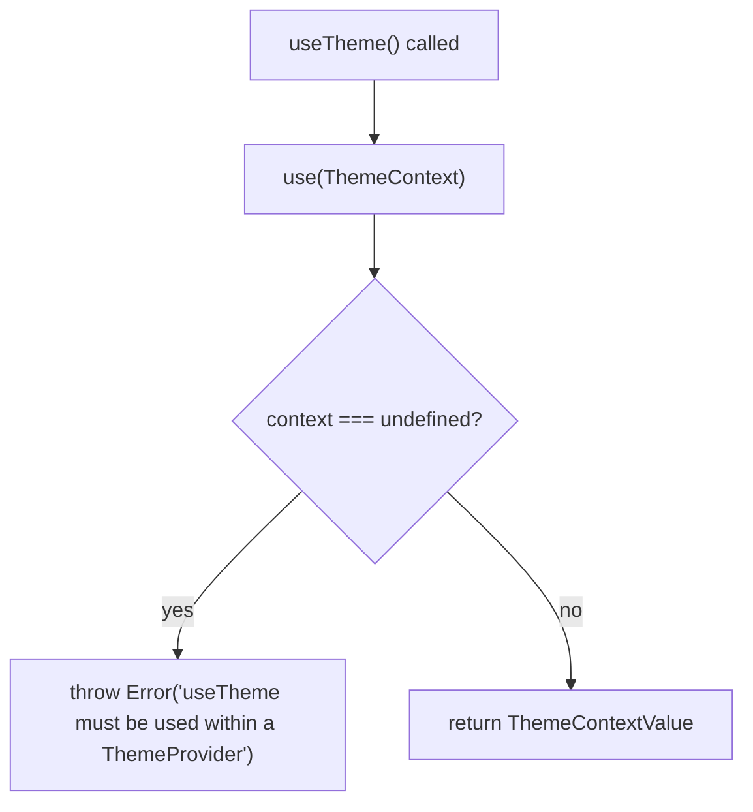
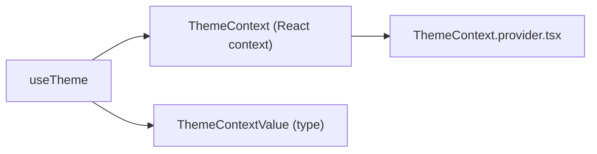
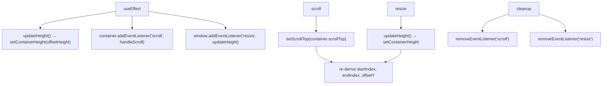

# hooks/ Architecture

Custom React hooks shared across the application.

## File Structure

```
hooks/
├── index.ts                        → Barrel export
├── useClickOutside.hook.ts         → Detect mousedown outside a DOM element
├── useStore.hook.ts                → Lightweight external store (useSyncExternalStore-compatible)
├── useTheme.hook.ts                → Access ThemeContext via React 19 use()
└── useVirtualization.hook.ts       → Virtual-scroll geometry computation
```

## Hook Summary

| Hook                | Category      | Returns                                | Key dependency                           |
| ------------------- | ------------- | -------------------------------------- | ---------------------------------------- |
| `useClickOutside`   | DOM event     | `void`                                 | `document` mousedown                     |
| `useStore`          | State mgmt    | `TStore<TData>`                        | `useRef`, `shallowEqual`                 |
| `useTheme`          | Context       | `ThemeContextValue`                    | `ThemeContext`, `use()`                  |
| `useVirtualization` | Layout/scroll | `{ startIndex, endIndex, offsetY, … }` | `ResizeObserver`-like via `resize` event |

---

## `useClickOutside`

Fires `onClickOutside` whenever a `mousedown` event occurs outside `ref.current`.

### Signature

```ts
useClickOutside({ ref, onClickOutside }): void
```

### Flow



### Args

| Field            | Type                             | Description                       |
| ---------------- | -------------------------------- | --------------------------------- |
| `ref`            | `RefObject<HTMLElement \| null>` | Element whose boundary is guarded |
| `onClickOutside` | `() => void`                     | Called on outside mousedown       |

> Both `ref` and `onClickOutside` are dependencies of the `useEffect`. Consumers should stabilise `onClickOutside` with `useCallback` to avoid re-registering the listener on every render.

---

## `useStore`

Creates a ref-based external store that is compatible with `useSyncExternalStore`. Uses shallow equality to suppress no-op updates.

### Signature

```ts
useStore<TData extends Record<string, unknown>>(initialState?: TData): TStore<TData>
```

### `TStore<TData>` interface

| Method                | Signature                         | Description                                                     |
| --------------------- | --------------------------------- | --------------------------------------------------------------- |
| `get()`               | `() => TData \| undefined`        | Returns current state                                           |
| `getServerSnapshot()` | `() => TData \| undefined`        | Returns **initial** state — used by SSR hydration               |
| `set(partial)`        | `(value: Partial<TData>) => void` | Merges partial update; notifies listeners only if state changed |
| `reset()`             | `() => void`                      | Restores state to `initialState`; always notifies               |
| `subscribe(cb)`       | `(cb: () => void) => () => void`  | Registers a listener; returns unsubscribe function              |

### Internal Structure



### Update Flow



### Canonical Usage

```tsx
const store = useStore<{ count: number }>({ count: 0 });

const count = useSyncExternalStore(
  store.subscribe,
  () => store.get()?.count ?? 0,
  () => store.getServerSnapshot()?.count ?? 0,
);

store.set({ count: count + 1 });
```

### Design Notes

- **No React state** — the store lives in `useRef`, so mutations never cause the owning component to re-render directly.
- **Shallow equality guard** prevents `set` from notifying listeners when the merged object is identical to the previous state.
- **`getServerSnapshot`** always returns the `initialState` snapshot, satisfying React's SSR hydration contract.
- The listener `Set` is also a ref, so subscribe/unsubscribe operations are stable across renders.

---

## `useTheme`

Accesses `ThemeContext` using React 19's `use()` API. Throws if called outside `ThemeProvider`.

### Signature

```ts
useTheme(): ThemeContextValue
```

### `ThemeContextValue`

| Field         | Type                         | Description                           |
| ------------- | ---------------------------- | ------------------------------------- |
| `theme`       | `'light' \| 'dark'`          | Current active theme                  |
| `isDarkMode`  | `boolean`                    | Convenience flag — `theme === 'dark'` |
| `setTheme`    | `(theme: ThemeMode) => void` | Set theme explicitly                  |
| `toggleTheme` | `() => void`                 | Toggle between `'light'` and `'dark'` |

### Flow



### Dependencies



### Design Note

Uses `use(ThemeContext)` (React 19) rather than `useContext`. This enables calling the hook inside conditional branches and Suspense boundaries where `useContext` is not allowed.

---

## `useVirtualization`

Computes which items in a large list are currently visible and calculates the CSS geometry needed for virtual rendering (translate offset, total scroll height).

### Signature

```ts
useVirtualization(args: UseVirtualizationArgs): UseVirtualizationResult
```

### `UseVirtualizationArgs`

| Field                    | Type                             | Default | Description                                   |
| ------------------------ | -------------------------------- | ------- | --------------------------------------------- |
| `containerRef`           | `RefObject<HTMLElement \| null>` | —       | Scroll container element                      |
| `defaultContainerHeight` | `number`                         | `400`   | Fallback height before DOM measurement        |
| `itemHeight`             | `number`                         | —       | Fixed row height in pixels (required)         |
| `overscan`               | `number`                         | `3`     | Extra rows rendered beyond the visible window |
| `totalItems`             | `number`                         | —       | Total number of items in the list             |

### Return Values

| Field                | Type     | Formula                                                     |
| -------------------- | -------- | ----------------------------------------------------------- |
| `startIndex`         | `number` | `max(0, floor(scrollTop / itemHeight) - overscan)`          |
| `endIndex`           | `number` | `min(totalItems, startIndex + visibleCount + overscan × 2)` |
| `offsetY`            | `number` | `startIndex × itemHeight` — CSS `translateY` value          |
| `totalHeight`        | `number` | `totalItems × itemHeight` — virtual scroll area height      |
| `containerHeight`    | `number` | Measured `offsetHeight` of the container                    |
| `visibleCount`       | `number` | `ceil(containerHeight / itemHeight)`                        |
| `bottomSpacerHeight` | `number` | Space below rendered items (for layout completeness)        |

### Geometry Diagram

```
┌────────────────────────────────────────┐ ─── totalHeight (px)
│                                        │
│  [skipped: startIndex items]           │ ─── offsetY = startIndex × itemHeight
│                                        │
│ ┌──────────────────────────────────┐   │
│ │  rendered items                  │   │ ─── visible window + overscan
│ │  startIndex … endIndex           │   │
│ └──────────────────────────────────┘   │
│                                        │
│  [skipped: remaining items]            │
└────────────────────────────────────────┘
```

### State & Effects



### Zero-Height Guard

When `container.offsetHeight === 0` (e.g. inside a React `<Activity mode='hidden'>` panel), `updateHeight` skips the update to preserve the last valid height and prevent layout shifts.

### Overscan Purpose

The `overscan` rows are rendered **above** `startIndex` and **below** the visible bottom. This prevents blank flicker when scrolling quickly by keeping a buffer of pre-rendered rows outside the viewport.

| `overscan` value  | Rows above | Rows below      |
| ----------------- | ---------- | --------------- |
| `3` (default)     | 3          | 6 (2× overscan) |
| `5` (VirtualList) | 5          | 10              |
