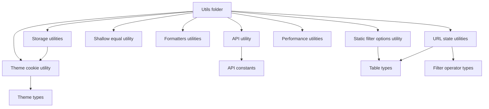
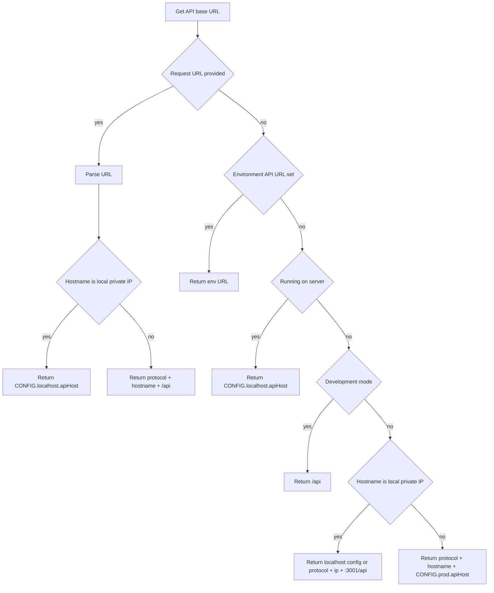
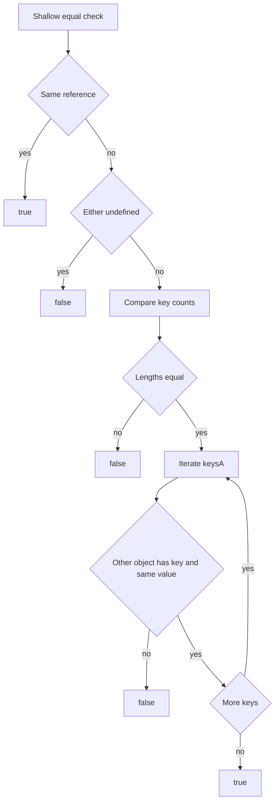

# Utils Architecture

Shared utility layer for formatting, URL state encoding/decoding, storage,
performance instrumentation, and environment-aware API URL resolution.

## Folder Structure

```
utils/
├── ARCHITECTURE.md                     -> This overview
├── index.ts                            -> Root barrel (currently exports shallowEqual)
├── api.ts                              -> API base URL resolution
├── createStaticFilterOptions.util.ts   -> Static filter options adapter
├── shallowEqual.util.ts                -> Shallow object equality helper
├── theme-cookie.util.ts                -> Theme cookie parse/read/write helpers
├── formatters/
│   └── ARCHITECTURE.md                 -> Detailed formatter utilities
├── storage/
│   └── ARCHITECTURE.md                 -> Cookie/localStorage utilities
├── performance/
│   └── ARCHITECTURE.md                 -> Render tracking utilities
└── urlState/
    └── ARCHITECTURE.md                 -> URL compact state serialization
```

## Dependency Overview



## Top-Level Utilities

### api.ts

Resolves API base URL through prioritized environment-aware strategies:

1. Request URL (SSR source of truth)
2. `VITE_API_URL`
3. SSR default localhost API host
4. Client-side hostname/protocol logic (dev proxy, private IPs, prod config)



Notes:

- Uses `isLocalIp` helper to detect localhost/private network ranges.
- Handles malformed request URL by falling through gracefully.

### createStaticFilterOptions.util.ts

Adapts static arrays to the async table filter-options contract.

```mermaid
flowchart TD
  A[Create static filter options] --> B[Return object with three functions]
  B --> C[fetchFilterOptions with skip and limit]
  C --> D[Sliced values: values.slice(skip, skip + limit)]
  D --> E[Resolve Promise with values + hasMore]
  B --> F[Filter options data selector]
  B --> G[filterOptionsDataTotalSelector with hasMore logic]
```

Notes:

- Preserves the same API contract as server-backed filter option fetchers.
- Supports pagination semantics for UI consistency.

### shallowEqual.util.ts

Performs shallow equality checks for object snapshots.



Notes:

- Used by store/state layers to avoid unnecessary update notifications.
- Intentionally shallow: nested object differences require higher-level logic.

### theme-cookie.util.ts

Provides theme cookie parsing, reading, and writing (`light`/`dark`).

```mermaid
flowchart TD
  subgraph ReadPath
    A[Get theme from cookie header] --> B{Cookie header present}
    B -- no --> C[undefined]
    B -- yes --> D[parseCookies(cookieHeader)]
    D --> E[Read theme cookie]
    E --> F{Theme is dark or light}
    F -- yes --> G[Return ThemeMode]
    F -- no --> H[undefined]
  end

  subgraph WritePath
    I[Set theme cookie] --> J{Document exists}
    J -- no --> K[Return]
    J -- yes --> L[Compute max-age]
    L --> M[document.cookie = theme cookie string]
  end
```

Notes:

- `parseCookies` safely parses `name=value` pairs including values containing `=`.
- `setThemeCookie` has SSR guard and uses `SameSite=Lax`.

## Subfolder Documentation

- `formatters/ARCHITECTURE.md`
- `storage/ARCHITECTURE.md`
- `performance/ARCHITECTURE.md`
- `urlState/ARCHITECTURE.md`
