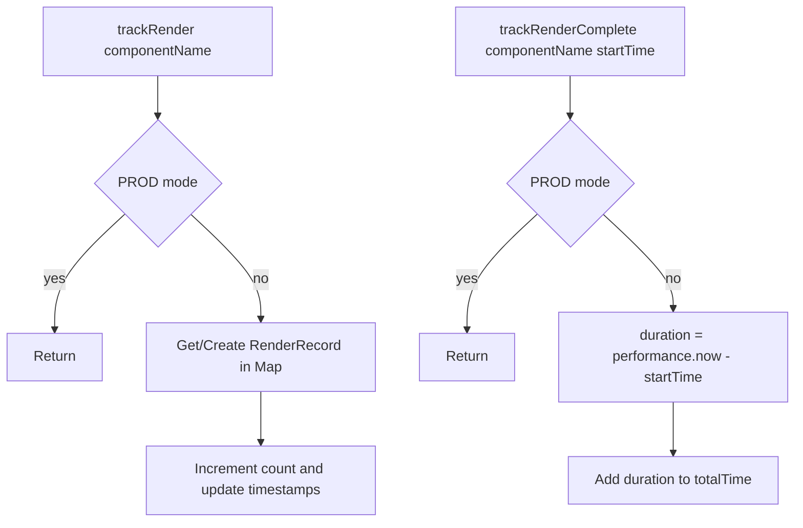
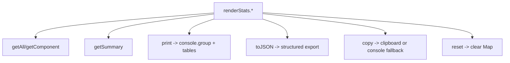
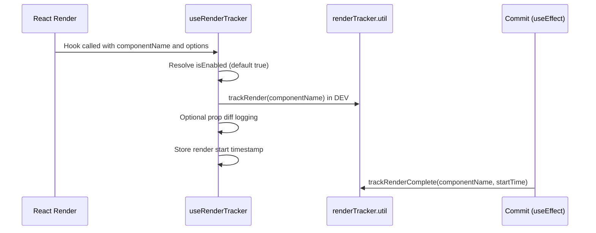

# Performance Utils Architecture

Development-only render instrumentation for measuring component render counts,
timings, and prop-change diagnostics.

## File Structure

```
performance/
├── ARCHITECTURE.md
├── index.ts
├── renderTracker.util.ts
└── useRenderTracker.hook.ts
```

## Dependency Graph

```mermaid
graph TD
  Index[index.ts] --> Hook[useRenderTracker.hook.ts]
  Hook --> Util[renderTracker.util.ts]
  Util --> Window[window.__renderStats (DEV only)]
```

## Utilities

### renderTracker.util.ts

Core tracking system storing per-component render records in an in-memory map.

Record fields:

- `count`: number of renders
- `lastRenderTime`: timestamp relative to session start
- `renderTimes`: sampled render timestamps (up to 100)
- `totalTime`: cumulative measured render duration



`renderStats` API:

- `getAll`, `getComponent`, `getSummary`
- `print` (console tables)
- `toJSON` (export payload)
- `copy` (clipboard when available)
- `reset`



Environment behavior:

- Disabled in production via `import.meta.env.PROD` guards.
- In development, exposes `globalThis.__renderStats` for console use.

### useRenderTracker.hook.ts

Hook wrapper integrating tracking into component lifecycle.



Key behavior:

- Optional `logProps` compares previous/current props by strict equality.
- Logs changed prop keys for render diagnostics.
- Uses `useEffect` without dependency array to run after each commit.

## Barrel Exports

`index.ts` exports only `useRenderTracker` as the public API.
