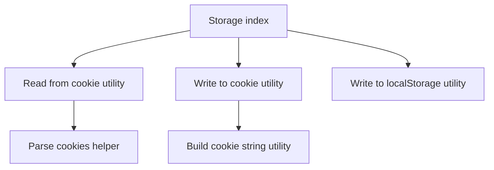
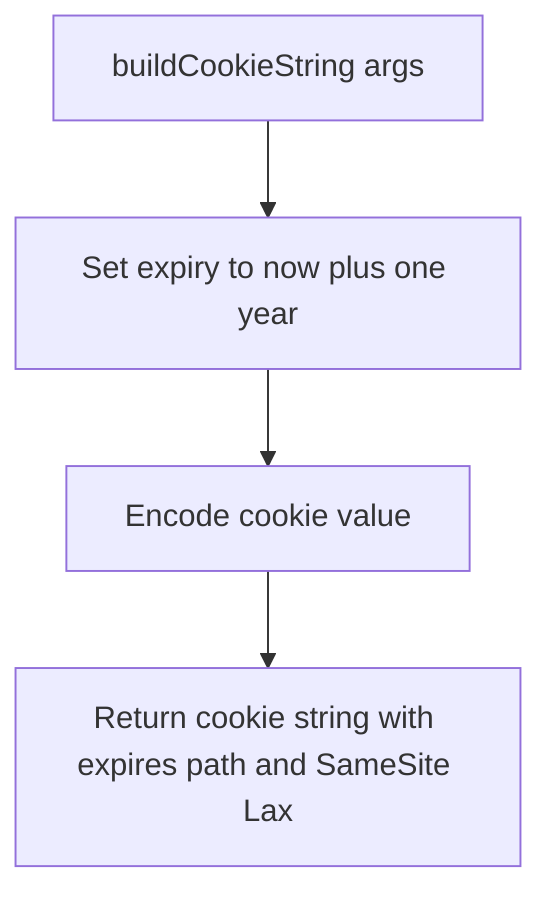
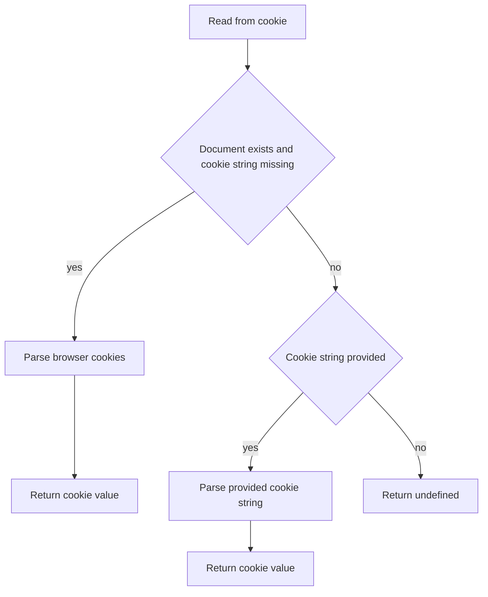
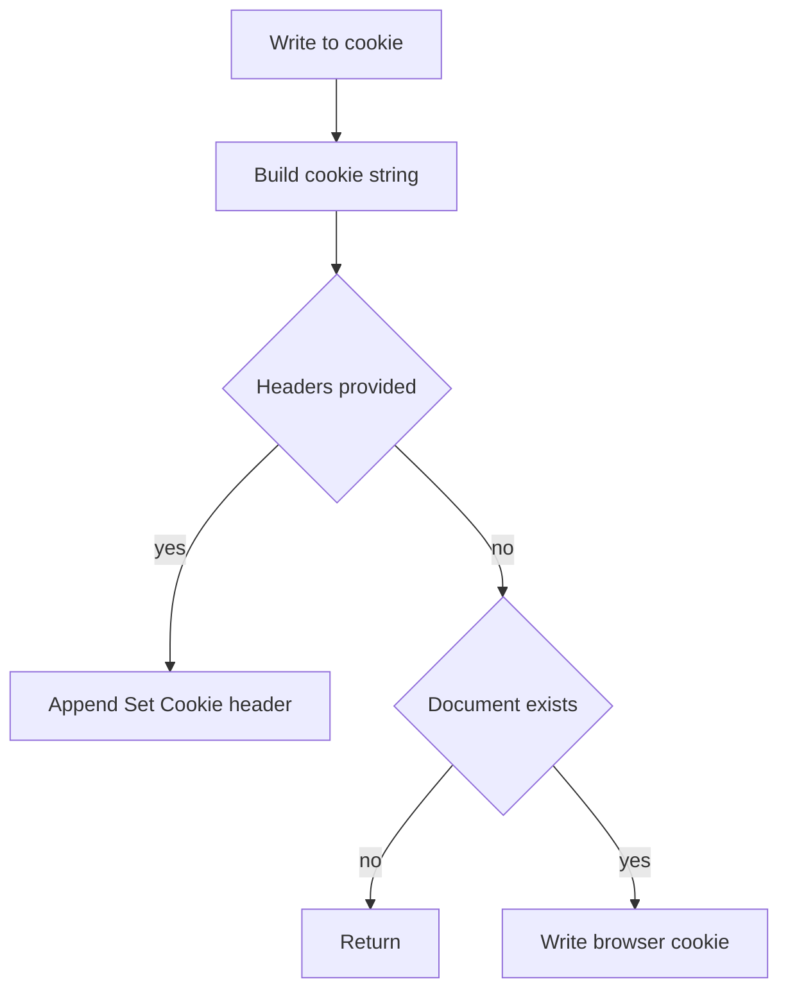
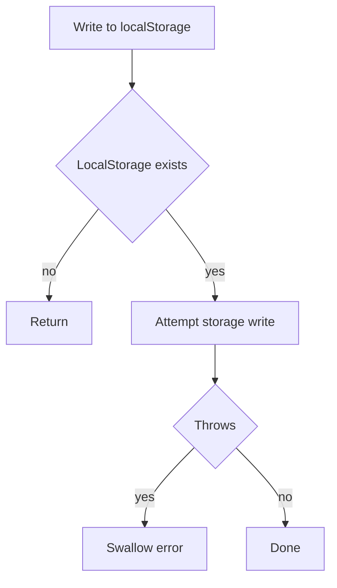

# Storage Utils Architecture

Environment-safe persistence helpers for cookies and localStorage with SSR support.

## File Structure

```
storage/
├── ARCHITECTURE.md
├── index.ts
├── buildCookieString.util.ts
├── readFromCookie.util.ts
├── writeToCookie.util.ts
└── writeToLocalStorage.util.ts
```

## Dependency Graph



## Utilities

### buildCookieString.util.ts

Builds a one-year cookie string with URL-encoded value.



Key behavior:

- Uses `encodeURIComponent` to preserve special characters.
- Forces site-wide path and lax same-site policy.

### readFromCookie.util.ts

Reads cookie value in browser or SSR context.



Key behavior:

- Uses `parseCookies` from theme cookie utility to keep parser logic shared.
- Supports SSR by accepting explicit `cookieString` input.

### writeToCookie.util.ts

Writes cookies in either server response headers or browser runtime.



Key behavior:

- SSR path: appends `Set-Cookie` to response headers.
- Browser path: writes via `document.cookie`.
- No-op when called outside browser without `headers`.

### writeToLocalStorage.util.ts

Safely writes to localStorage without throwing on restricted environments.



Key behavior:

- Designed to tolerate private mode, quota limits, and disabled storage.

## Barrel Exports

`index.ts` exports:

- `readFromCookie`
- `writeToCookie`
- `writeToLocalStorage`
