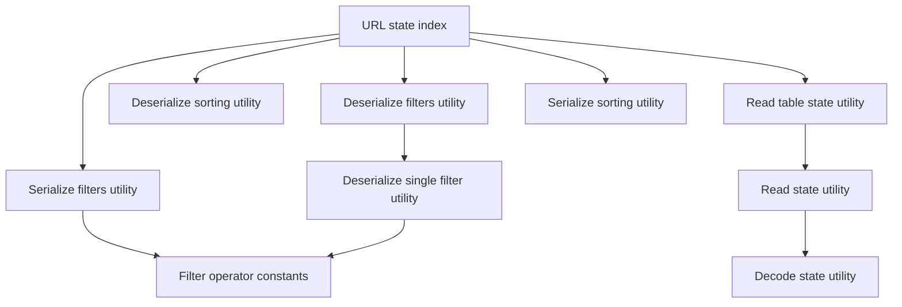
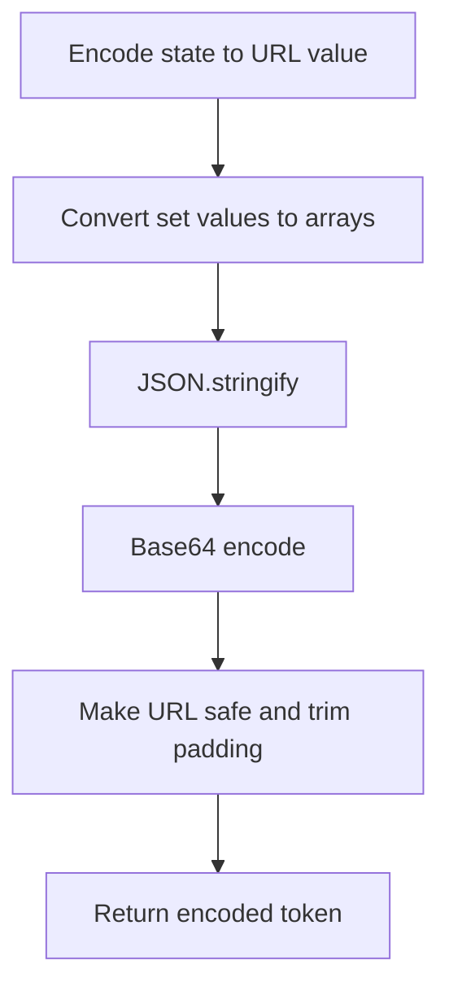
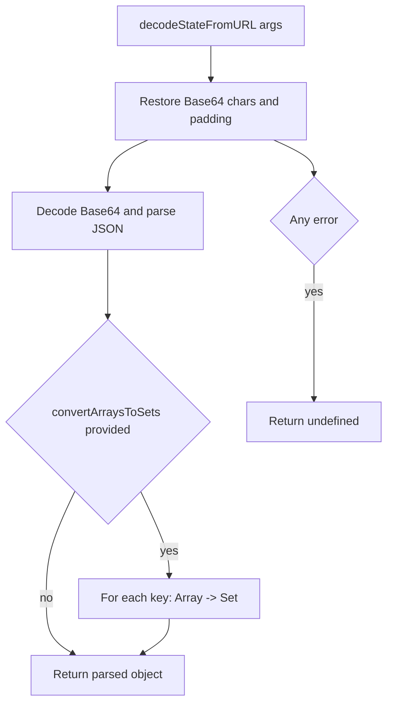
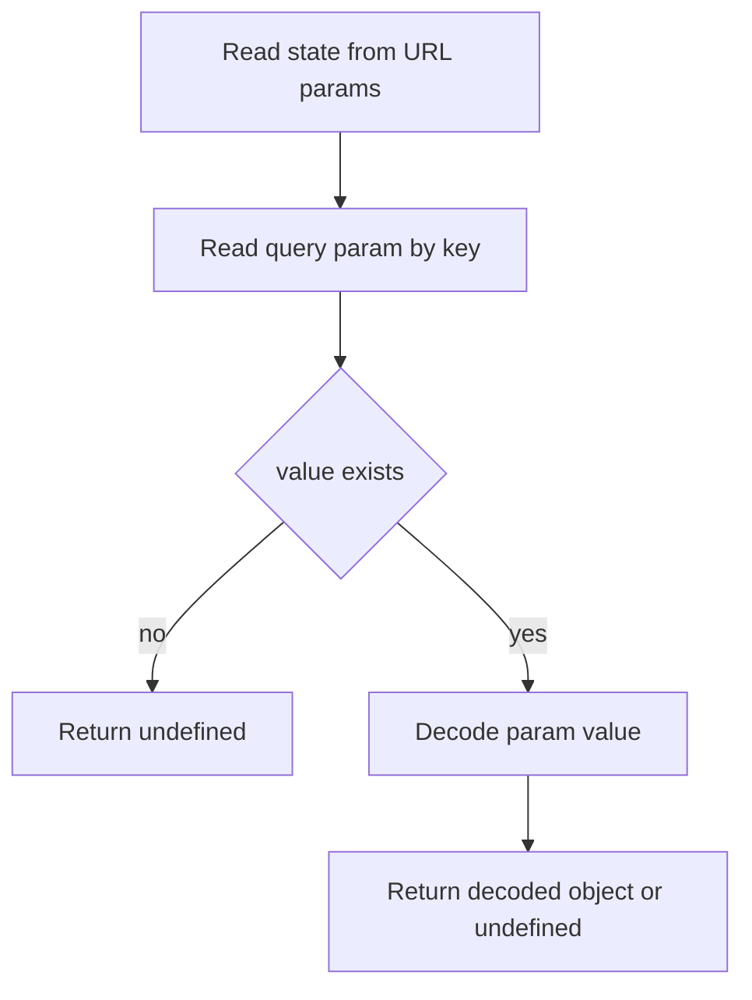
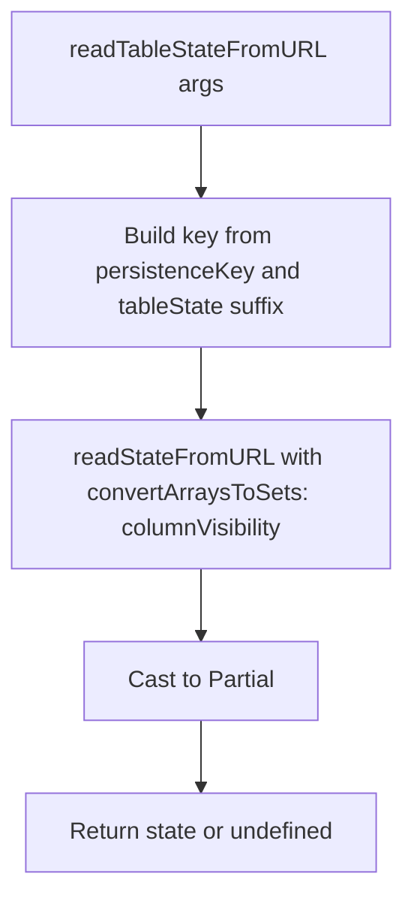
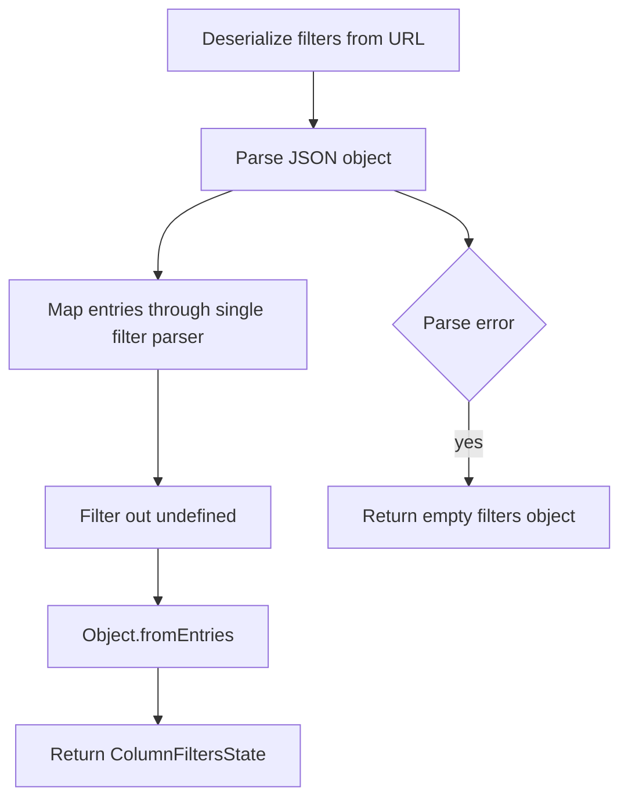

# URL State Utils Architecture

Compact serialization/deserialization helpers for table state in URL query params.
Designed for shareable links, SSR hydration, and resilient decoding.

## File Structure

```
urlState/
├── ARCHITECTURE.md
├── index.ts
├── encodeStateToURL.util.ts
├── decodeStateFromURL.util.ts
├── readStateFromURL.util.ts
├── readTableStateFromURL.util.ts
├── serializeSortingToURL.util.ts
├── deserializeSortingFromURL.util.ts
├── serializeFiltersToURL.util.ts
├── deserializeFilter.util.ts
└── deserializeFiltersFromURL.util.ts
```

## Dependency Graph



## Utilities

### encodeStateToURL.util.ts

Encodes plain object state into Base64 URL-safe string.



Key behavior:

- Ensures `Set` values are serializable.
- Produces compact URL-safe payload.

### decodeStateFromURL.util.ts

Decodes URL-safe Base64 state and optionally rehydrates arrays into sets.



### readStateFromURL.util.ts

Reads named query param and decodes via `decodeStateFromURL`.



### readTableStateFromURL.util.ts

Table-specific wrapper around `readStateFromURL`.



Typed state envelope:

- `columnOrder?`
- `columnVisibility?`
- `filters?`
- `sorting?`

### serializeSortingToURL.util.ts

Compacts sorting array into object map for shorter query payload.

```mermaid
flowchart TD
  A[serializeSortingToURL(sorting)] --> B{sorting empty?}
  B -- yes --> C[undefined]
  B -- no --> D[Filter entries with direction]
  D --> E[Map to key direction pairs]
  E --> F{entries empty}
  F -- yes --> G[undefined]
  F -- no --> H[Build object and stringify]
```

Example transform:

- Input: `[{ columnKey: 'name', direction: 'asc' }]`
- Output: `{"name":"asc"}`

### deserializeSortingFromURL.util.ts

Rebuilds sorting array from compact object representation.

```mermaid
flowchart TD
  A[deserializeSortingFromURL(param)] --> B[JSON.parse]
  B --> C[Object.entries(parsed)]
  C --> D[Map entries to sorting items]
  D --> E[Return SortingState]
  B --> F{Parse error}
  F -- yes --> G[Return empty array]
```

### serializeFiltersToURL.util.ts

Compacts column filters into JSON string using short operator codes and reduced shape.

```mermaid
flowchart TD
  A[serializeFiltersToURL(filters)] --> B{No filters}
  B -- yes --> C[undefined]
  B -- no --> D[Serialize each column filter]
  D --> E[Object.fromEntries compact object]
  E --> F[JSON.stringify]
```

`serializeFilter` behavior by filter type:

- `boolean` -> bare boolean
- `text/number/date` -> `[shortOp, value]` or `[shortOp, value, value2]`
- `select/multiSelect` -> values array or `['!', ...values]` for `notEquals`

### deserializeFilter.util.ts

Infers filter type from compact value shape and expands short codes.

```mermaid
flowchart TD
  A[deserializeFilter(value)] --> B{boolean value}
  B -- yes --> C[Return boolean filter]
  B -- no --> D{array value}
  D -- no --> E[undefined]
  D -- yes --> F{empty array}
  F -- yes --> E
  F -- no --> G[Read first token]

  G --> H{First token is marker}
  H -- yes --> I[select notEquals]

  G --> J{Known operator code}
  J -- yes --> K[Expand operator]
  K --> L{numeric payload}
  L -- yes --> M[number filter]
  K --> N{date-like payload with date operator}
  N -- yes --> O[date filter]
  K --> P{text operator with string payload}
  P -- yes --> Q[text filter]

  J -- no --> R{All strings array}
  R -- yes --> S[select equals filter]
  R -- no --> E
```

### deserializeFiltersFromURL.util.ts

Deserializes complete filters payload by applying `deserializeFilter` per entry.



## Public API

`index.ts` exports:

- `deserializeFiltersFromURL`
- `deserializeSortingFromURL`
- `readTableStateFromURL`
- `serializeFiltersToURL`
- `serializeSortingToURL`
